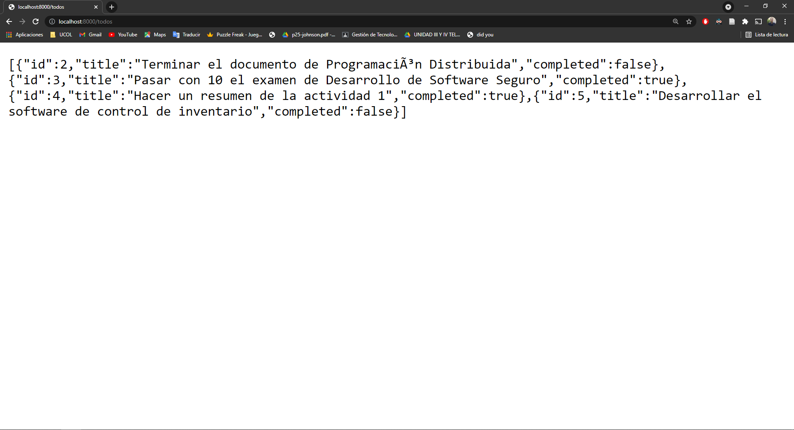
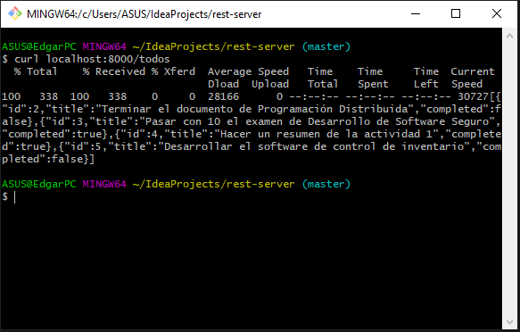

# Todos API

Edgar Marcelino Zamora Cruz 6°K

El presente proyecto tiene la misión de servir como un servidor tipo rest que puede ofrecer la consulta de pendientes llamados "todos".


## Instalación
Primeramente deberás descargar todos los archivos desde el repositorio de github con el siguiente comando:
```git clone https://github.com/RDIPIPOM/rest-api.git```

Para poner en funcionamiento desde IntelliJ IDEA basta con abrir el archivo App ubicado en \src\main\java\mx\ucol\ y presionar Ctrl+Mayús+F10 para correrlo.
También existe una manera de correrlo desde la línea de comandos ejecutando los siguientes comandos:

```mvn package```

Posteriormente ejecutamos el JAR con dependencias:

```java -cp target/rest-server-1.0-SNAPSHOT-jar-with-dependencies.jar mx.ucol.App```

Es necesario resaltar que el servidor correrá a través del puerto 8000 y éste puede ser cambiado desde el archivo App

## Endpoints

La API solo cuenta con un solo endpoint:

```/todos```: Devuelve todos los registros de la tabla todos (pendintes)

## Uso

Para hacer uso del endpoint mencionado podemos hacerlo con ayuda de la herramienta curl

```curl localhost:8000/todos```

O también hacer uso del navegador colocando la url ```localhost:8000/todos```

que nos debería de retornar la siguiente respuesta:

```
[
{"id":2,"title":"Terminar el documento de Programación Distribuida","completed":false},
{"id":3,"title":"Pasar con 10 el examen de Desarrollo de Software Seguro","completed":true},
{"id":4,"title":"Hacer un resumen de la actividad 1","completed":true},
{"id":5,"title":"Desarrollar el software de control de inventario","completed":false}
]
```




## SGDB

El SGDB utilizado para este proyecto fue SQLITE se eligió debido a su sencillo funcionamiento y fácil instalación, además de que no requiere un servicio apache externo que lo esté ejecutando.

## Dependencias usadas en el proyecto
```
  <dependencies>
    <dependency>
      <groupId>junit</groupId>
      <artifactId>junit</artifactId>
      <version>4.11</version>
      <scope>test</scope>
    </dependency>
    <dependency>
      <groupId>com.fasterxml.jackson.core</groupId>
      <artifactId>jackson-databind</artifactId>
      <version>2.11.1</version>
    </dependency>
    <dependency>
        <groupId>org.xerial</groupId>
        <artifactId>sqlite-jdbc</artifactId>
        <version>3.34.0</version>
    </dependency>
  </dependencies>
```

JUnit es un conjunto de clases (framework) que permite realizar la ejecución de clases Java de manera controlada, para poder evaluar si el funcionamiento de cada uno de los métodos de la clase se comporta como se espera.

jackson-databind es una dependencia que nos ayuda a convertir datos, en este caso fue usada para convertir objetos de java a objetos y viceversa

sqlite-jdbc fue el driver que nos otorgó las posibilidad de tener conexión con la base de datos de tipo SQLITE

## Conclusión
La realización de este proyecto ayudó en gran medida ha comprender el funcionamiento interno de las APIs basadas en rest. A pesar de no concretar todos los tipos de solicitudes fue una gran experiencia y apredizaje.
